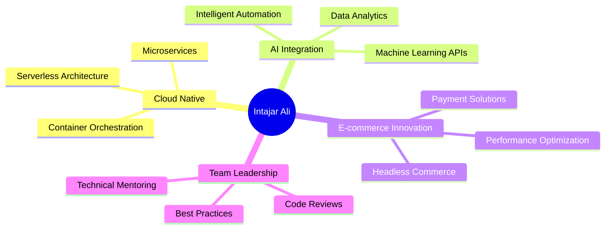

<div align="center">

# 👋 Hello, I'm **Intajar Ali**

<div align="center">
  
</div>


<br/>

</div>

---

<br/>

<div align="center">

## 🎯 **About Me**

</div>

<table>
<tr>
<td width="50%">

### 🚀 **Professional Journey**

**I'm a Senior Full-Stack Developer and DevOps Engineer with 11+ years of expertise in crafting scalable digital solutions. My passion lies in transforming complex business requirements into elegant, high-performance applications.**

**What drives me:**
- 🎨 Creating seamless user experiences
- ⚡ Optimizing system performance
- 🔧 Building robust infrastructure
- 📈 Scaling applications efficiently

</td>
<td width="50%">

### 💡 **Core Philosophy**

```typescript
const philosophy = {
  code: "Clean, maintainable, scalable",
  approach: "Problem-solving first",
  mindset: "Continuous learning",
  goal: "Exceptional user experience"
};
```

<br/>

**Key Strengths:**
- 🌉 Bridging Dev & Ops seamlessly
- 🎯 End-to-end solution architecture
- 🤝 Cross-functional team leadership
- 🔄 Agile development practices

</td>
</tr>
</table>

---

<br/>

<div align="center">

## 🛠️ **Technology Ecosystem**

</div>

<div align="center">

### **Frontend Arsenal**


### **Backend & Database**


### **Cloud & DevOps**


### **E-commerce & Tools**


</div>

---

<br/>

<div align="center">

## 📊 **GitHub Analytics**

</div>

<div align="center">


</div>

---

<br/>

<div align="center">

## 🏆 **Professional Impact**

</div>

<div align="center">

<table>
<tr>
<td align="center" width="20%">

<br/><sub><b>Years of Excellence</b></sub>
</td>
<td align="center" width="20%">

<br/><sub><b>Successful Deliveries</b></sub>
</td>
<td align="center" width="20%">

<br/><sub><b>Infrastructure Solutions</b></sub>
</td>
<td align="center" width="20%">

<br/><sub><b>Online Stores Built</b></sub>
</td>
<td align="center" width="20%">

<br/><sub><b>System Connections</b></sub>
</td>
</tr>
</table>

</div>

---

<br/>

<div align="center">

## 💼 **Service Portfolio**

</div>

<table>
<tr>
<td width="33%" align="center">

### 🎨 **Frontend Development**


**Modern Web Applications**
- React & Next.js Development
- TypeScript Implementation
- Responsive UI/UX Design
- Performance Optimization
- Progressive Web Apps

</td>
<td width="33%" align="center">

### ⚡ **Backend Engineering**


**Scalable Server Solutions**
- Node.js & Express APIs
- Microservices Architecture
- Database Design & Optimization
- Real-time Applications
- GraphQL Implementation

</td>
<td width="33%" align="center">

### ☁️ **DevOps & Cloud**


**Infrastructure Excellence**
- AWS Cloud Architecture
- Docker & Kubernetes
- CI/CD Pipeline Setup
- Monitoring & Logging
- Security Implementation

</td>
</tr>
</table>

---

<br/>

<div align="center">

## 🎯 **Current Focus Areas**

</div>

<div align="center">



</div>

<br/>

<div align="center">

**🔹 Serverless & Edge Computing** | **🔹 AI/ML Integration** | **🔹 Headless E-commerce**  
**🔹 Performance Engineering** | **🔹 Team Leadership** | **🔹 Technical Architecture**

</div>

---

<br/>

<div align="center">

## 🌟 **Let's Build Something Amazing**

</div>

<div align="center">

<table>
<tr>
<td align="center">

### 📬 **Get In Touch**

[](https://linkedin.com/in/your-linkedin)
[](mailto:your.email@example.com)
[](https://your-portfolio.com)

</td>
<td align="center">

### 💼 **Collaboration**

[](https://discord.gg/your-discord)
[](https://twitter.com/your-twitter)
[](https://calendly.com/your-calendly)

</td>
</tr>
</table>

</div>

<br/>

<div align="center">

### 🚀 **Available For**

**Full-time Opportunities** • **Contract Projects** • **Technical Consulting**  
**Architecture Reviews** • **Team Mentoring** • **Code Audits**

</div>

---

<br/>

<div align="center">

## 🎮 **Beyond Code**

</div>

<div align="center">


</div>

<table>
<tr>
<td width="50%" align="center">

### 🌱 **Currently Learning**
- **AI/ML Integration** in web apps
- **Blockchain** development
- **Edge Computing** solutions
- **Advanced Kubernetes** patterns

</td>
<td width="50%" align="center">

### 🎯 **Personal Interests**
- **🎮 Gaming** & tech reviews
- **📚 Technical Writing** & blogging
- **🌍 Open Source** contributions
- **🤝 Developer Community** building

</td>
</tr>
</table>

---

<br/>

<div align="center">

### 💭 **Developer Wisdom**

*"The best code is not just functional—it's elegant, maintainable, and tells a story."*

<br/>


</div>

---

<br/>

<div align="center">


### 🤝 **Ready to Transform Your Ideas into Reality?**

**Let's discuss how my 11+ years of expertise can accelerate your next project!**

<br/>

[](https://github.com/YourGitHubUsername)
[](https://github.com/YourGitHubUsername?tab=followers)
[](https://github.com/YourGitHubUsername?tab=repositories)

<br/>

⭐ **Star some repositories if you find them interesting!** ⭐

</div>
